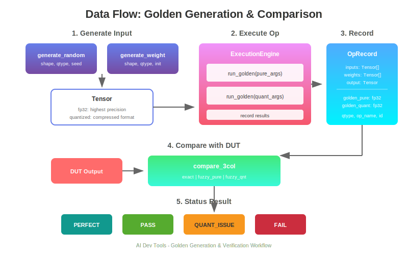

# AI Dev Tools 架构设计

## 1. 概述

AI Dev Tools 是一套用于自研芯片算子验证的工具集，提供从 Golden 生成、数据量化、到精度比对的完整工作流。

### 1.1 核心能力

- **Golden 生成**：支持 Python/C++ 双模式算子实现
- **量化格式**：BFP (Block Floating Point)、GFloat 等自定义格式
- **精度模式**：pure (纯 fp32) / quant (量化感知) 双轨验证
- **三列比对**：exact (精确) + fuzzy_pure (模糊-纯fp32) + fuzzy_qnt (模糊-量化)
- **状态判定**：PERFECT → PASS → QUANT_ISSUE → FAIL

## 2. 架构总览


### 2.1 分层架构

```
┌─────────────────────────────────────────────────────────────────────────────┐
│                              应用层 (Application)                            │
│  ┌──────────────┐  ┌──────────────┐  ┌──────────────┐  ┌──────────────┐    │
│  │  demos/      │  │  xlsx 工作流  │  │  Python API  │  │    CLI       │    │
│  │  示例脚本    │  │  表格驱动     │  │  编程接口    │  │  命令行      │    │
│  └──────────────┘  └──────────────┘  └──────────────┘  └──────────────┘    │
└─────────────────────────────────────┬───────────────────────────────────────┘
                                      │
┌─────────────────────────────────────▼───────────────────────────────────────┐
│                              核心层 (Core)                                   │
│  ┌──────────────┐  ┌──────────────┐  ┌──────────────┐  ┌──────────────┐    │
│  │   config     │  │    tensor    │  │      op      │  │    engine    │    │
│  │   全局配置   │  │  统一张量    │  │  算子注册    │  │   执行引擎   │    │
│  └──────────────┘  └──────────────┘  └──────────────┘  └──────────────┘    │
└─────────────────────────────────────┬───────────────────────────────────────┘
                                      │
┌─────────────────────────────────────▼───────────────────────────────────────┐
│                              工具层 (Tools)                                  │
│  ┌──────────────┐  ┌──────────────┐  ┌──────────────┐  ┌──────────────┐    │
│  │   compare    │  │    trace     │  │    xlsx      │  │   archive    │    │
│  │  三列比对    │  │   插桩捕获   │  │  表格解析    │  │   打包导出   │    │
│  └──────────────┘  └──────────────┘  └──────────────┘  └──────────────┘    │
└─────────────────────────────────────┬───────────────────────────────────────┘
                                      │
┌─────────────────────────────────────▼───────────────────────────────────────┐
│                              格式层 (Formats)                                │
│  ┌──────────────┐  ┌──────────────┐  ┌──────────────┐  ┌──────────────┐    │
│  │    numpy     │  │     raw      │  │  custom/bfp  │  │custom/gfloat │    │
│  │   npy/npz    │  │   二进制     │  │  块浮点      │  │  自定义浮点  │    │
│  └──────────────┘  └──────────────┘  └──────────────┘  └──────────────┘    │
└─────────────────────────────────────────────────────────────────────────────┘
```

## 3. 核心模块详解

### 3.1 config - 全局配置

```python
@dataclass
class GlobalConfig:
    golden_mode: str = "python"    # python | cpp
    precision: str = "quant"       # pure | quant
    seed: int = 42
    exact: ExactConfig             # 精确比对配置
    fuzzy: FuzzyConfig             # 模糊比对配置

@dataclass
class ExactConfig:
    max_abs: float = 0.0           # 允许的最大绝对误差
    max_count: int = 0             # 允许的最大不匹配数

@dataclass
class FuzzyConfig:
    atol: float = 1e-5             # 绝对容差
    rtol: float = 1e-3             # 相对容差
    min_qsnr: float = 30.0         # 最小 QSNR (dB)
    min_cosine: float = 0.99       # 最小余弦相似度
```

### 3.2 tensor - 统一张量

```python
@dataclass
class Tensor:
    fp32: np.ndarray                    # 最高精度数据
    quantized: Optional[np.ndarray]     # 量化后数据
    meta: Dict[str, Any]                # 量化元信息
    qtype: str                          # 量化类型

    @classmethod
    def from_fp32(cls, data, qtype) -> "Tensor":
        """从 fp32 创建 Tensor，自动量化"""

    def quantize_dequantize(self) -> "Tensor":
        """量化-反量化，模拟精度损失"""

    def to_qtype(self, qtype) -> "Tensor":
        """转换量化类型"""
```

**支持的量化类型：**
| 类型 | 说明 | 存储 |
|------|------|------|
| float32 | 原始精度 | fp32 |
| float16 | 半精度 | fp16 |
| bfp16 | 块浮点 16 (8-bit mantissa) | int8 + exp |
| bfp8 | 块浮点 8 (4-bit mantissa) | int8 + exp |
| bfp4 | 块浮点 4 (2-bit mantissa) | int8 + exp |
| gfloat16 | 自定义 16 位 (1+8+7) | uint16 |
| gfloat8 | 自定义 8 位 (1+4+3) | uint8 |
| gfloat4 | 自定义 4 位 (1+2+1) | uint8 |

### 3.3 op - 算子注册

```python
@dataclass
class OpSpec:
    name: str
    num_inputs: int = 1
    num_weights: int = 0
    supported_qtypes: List[str]

    def python_golden(self, *args, **kwargs) -> np.ndarray:
        """Python 实现的 Golden"""

    def cpp_golden(self, *args, **kwargs) -> np.ndarray:
        """C++ 实现的 Golden (可选)"""

# 注册算子
@register_op("linear")
class LinearOp(OpSpec):
    num_inputs = 1
    num_weights = 2  # weight + bias

    def python_golden(self, x, w, b=None):
        y = np.matmul(x, w)
        if b is not None:
            y = y + b
        return y
```

**内置算子：**
- linear, matmul, relu, gelu, softmax
- layernorm, attention, add, mul, embedding

### 3.4 engine - 执行引擎

```python
@dataclass
class OpRecord:
    id: int                              # 算子实例 ID
    op_name: str                         # 算子名称
    qtype: str                           # 量化类型
    inputs: List[Tensor]                 # 输入张量
    weights: List[Tensor]                # 权重张量
    output: Tensor                       # 输出张量
    golden_pure: np.ndarray              # 纯 fp32 Golden
    golden_quant: np.ndarray             # 量化感知 Golden

class ExecutionEngine:
    def run_op(self, op_name, inputs, weights, qtype, **kwargs) -> Tensor:
        """执行算子并记录结果"""

    def get_records(self) -> List[OpRecord]:
        """获取所有执行记录"""

    def dump(self, output_dir, format="raw"):
        """导出所有数据"""
```

## 4. 三列比对机制


### 4.1 比对结构

```
                    ┌─────────────┐
                    │  DUT 输出   │
                    │  (待验证)   │
                    └──────┬──────┘
                           │
           ┌───────────────┼───────────────┐
           │               │               │
           ▼               ▼               ▼
    ┌─────────────┐ ┌─────────────┐ ┌─────────────┐
    │   Exact     │ │ Fuzzy Pure  │ │ Fuzzy Quant │
    │  精确比对   │ │ vs 纯fp32   │ │ vs 量化感知 │
    └──────┬──────┘ └──────┬──────┘ └──────┬──────┘
           │               │               │
           ▼               ▼               ▼
    ┌─────────────────────────────────────────────┐
    │              状态判定 (Status)               │
    └─────────────────────────────────────────────┘
```

### 4.2 状态判定规则

| 状态 | 条件 | 含义 |
|------|------|------|
| **PERFECT** | exact ✓ | 完全一致 (bit-level) |
| **PASS** | fuzzy_qnt ✓ | 误差在量化容差内 |
| **QUANT_ISSUE** | fuzzy_pure ✓ 且 fuzzy_qnt ✗ | 量化导致的误差 |
| **FAIL** | fuzzy_pure ✗ 且 fuzzy_qnt ✗ | 算法实现错误 |

### 4.3 比对结果示例

```
====================================================================================================
op_name          exact  f_pure   f_qnt     max_abs     qsnr   cosine    status
----------------------------------------------------------------------------------------------------
linear_0           ✓       ✓       ✓      0.00e+00      inf 1.000000   PERFECT
relu_0             ✗       ✓       ✓      9.54e-07    129.2 1.000000     PASS
softmax_0          ✗       ✓       ✗      1.00e-01     29.0 0.999896 QUANT_ISSUE
matmul_0           ✗       ✗       ✗      1.00e+00      8.8 0.993808     FAIL
====================================================================================================
Summary: 1 PERFECT, 1 PASS, 1 QUANT_ISSUE, 1 FAIL (total: 4)
```

## 5. 数据流



### 5.1 Golden 生成流程

```
┌─────────────┐     ┌─────────────┐     ┌─────────────┐
│  生成输入   │ ──▶ │  执行算子   │ ──▶ │  记录结果   │
│ (Tensor)    │     │ (Engine)    │     │ (OpRecord)  │
└─────────────┘     └─────────────┘     └─────────────┘
      │                   │                   │
      │                   │                   │
      ▼                   ▼                   ▼
┌─────────────┐     ┌─────────────┐     ┌─────────────┐
│   fp32 +    │     │ golden_pure │     │   inputs    │
│  quantized  │     │ golden_quant│     │   weights   │
└─────────────┘     └─────────────┘     │   output    │
                                        └─────────────┘
```

### 5.2 比对验证流程

```
┌─────────────┐     ┌─────────────┐     ┌─────────────┐
│   加载      │ ──▶ │  三列比对   │ ──▶ │  生成报告   │
│ Golden+DUT  │     │ compare_3col│     │ print_table │
└─────────────┘     └─────────────┘     └─────────────┘
                          │
          ┌───────────────┼───────────────┐
          ▼               ▼               ▼
    ┌───────────┐   ┌───────────┐   ┌───────────┐
    │   exact   │   │fuzzy_pure │   │fuzzy_quant│
    │   result  │   │   result  │   │   result  │
    └───────────┘   └───────────┘   └───────────┘
```

## 6. 目录结构

```
aidevtools/
├── src/aidevtools/
│   ├── core/                    # 核心模块
│   │   ├── __init__.py          # 统一导出
│   │   ├── config.py            # 全局配置
│   │   ├── tensor.py            # 统一 Tensor
│   │   ├── op.py                # 算子注册
│   │   ├── engine.py            # 执行引擎
│   │   └── log.py               # 日志
│   │
│   ├── formats/                 # 数据格式
│   │   ├── base.py              # 格式基类
│   │   ├── numpy.py             # npy/npz
│   │   ├── raw.py               # 二进制
│   │   ├── quantize.py          # 量化注册表
│   │   └── custom/              # 自定义格式
│   │       ├── bfp/             # 块浮点
│   │       │   ├── golden.py    # Python 实现
│   │       │   └── _cpp/        # C++ 扩展
│   │       └── gfloat/          # 自定义浮点
│   │           └── golden.py
│   │
│   ├── tools/                   # 工具集
│   │   ├── compare/             # 比对工具
│   │   │   ├── diff.py          # 三列比对
│   │   │   ├── report.py        # 报告生成
│   │   │   └── export.py        # 失败导出
│   │   └── ...
│   │
│   ├── trace/                   # 插桩工具
│   │   ├── tracer.py            # @trace 装饰器
│   │   └── recorder.py          # 数据记录器
│   │
│   └── xlsx/                    # Excel 工作流
│       ├── parser.py            # 表格解析
│       └── runner.py            # 执行器
│
├── demos/                       # 示例
│   └── unified_workflow_demo.py # 统一工作流演示
│
├── tests/                       # 测试
│   ├── ut/                      # 单元测试
│   ├── it/                      # 集成测试
│   └── st/                      # 系统测试
│
└── docs/                        # 文档
    ├── architecture.md          # 架构设计
    └── tools/                   # 工具指南
```

## 7. 使用示例

### 7.1 基础使用

```python
from aidevtools.core import (
    set_config, get_config, reset_config,
    Tensor, generate_random, generate_weight,
    get_engine, clear, list_ops,
)
from aidevtools.tools.compare.diff import compare_3col, print_compare_table

# 1. 配置
set_config(golden_mode="python", precision="quant", seed=42)

# 2. 生成数据
x = generate_random(shape=(2, 4, 64), qtype="bfp8", seed=42)
w = generate_weight(shape=(64, 128), qtype="bfp8", seed=43)

# 3. 执行算子
engine = get_engine()
y = engine.run_op("linear", inputs=[x], weights=[w], qtype="bfp8")

# 4. 比对验证
config = get_config()
for r in engine.get_records():
    result = compare_3col(
        op_name=r.op_name, op_id=r.id,
        result=dut_output,
        golden_pure=r.golden_pure,
        golden_qnt=r.golden_quant,
        exact_max_abs=config.exact.max_abs,
        fuzzy_atol=config.fuzzy.atol,
        fuzzy_rtol=config.fuzzy.rtol,
        fuzzy_min_qsnr=config.fuzzy.min_qsnr,
        fuzzy_min_cosine=config.fuzzy.min_cosine,
    )
    print(f"{r.op_name}: {result.status}")
```

### 7.2 Excel 工作流

```bash
# 生成模板
aidevtools xlsx template model.xlsx

# 编辑 model.xlsx，定义算子序列

# 执行并比对
aidevtools xlsx run model.xlsx --output results/
```

## 8. 扩展指南

### 8.1 添加新算子

```python
from aidevtools.core.op import register_op, OpSpec

@register_op("my_op")
class MyOp(OpSpec):
    num_inputs = 2
    num_weights = 1
    supported_qtypes = ["float32", "bfp16", "bfp8"]

    def python_golden(self, x1, x2, w):
        return (x1 + x2) @ w
```

### 8.2 添加新量化格式

```python
from aidevtools.formats.quantize import register_quantize, register_dequantize

@register_quantize("my_format")
def to_my_format(data: np.ndarray, **kwargs):
    # 量化逻辑
    return quantized_data, meta

@register_dequantize("my_format")
def from_my_format(data: np.ndarray, meta: dict):
    # 反量化逻辑
    return fp32_data
```

## 9. 版本历史

| 版本 | 日期 | 变更 |
|------|------|------|
| v2.0 | 2025-01 | 统一工作流架构，三列比对 |
| v1.0 | 2024-01 | 初始版本，trace + compare |
